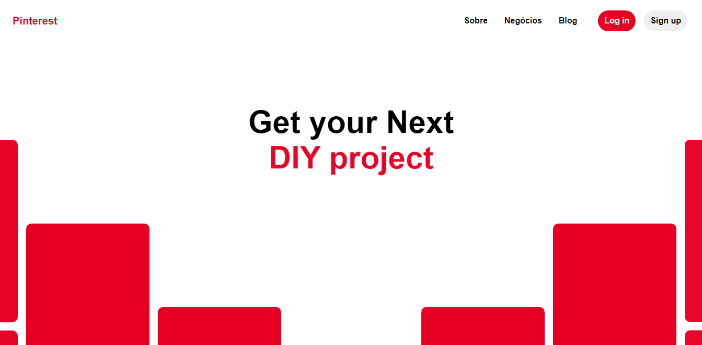
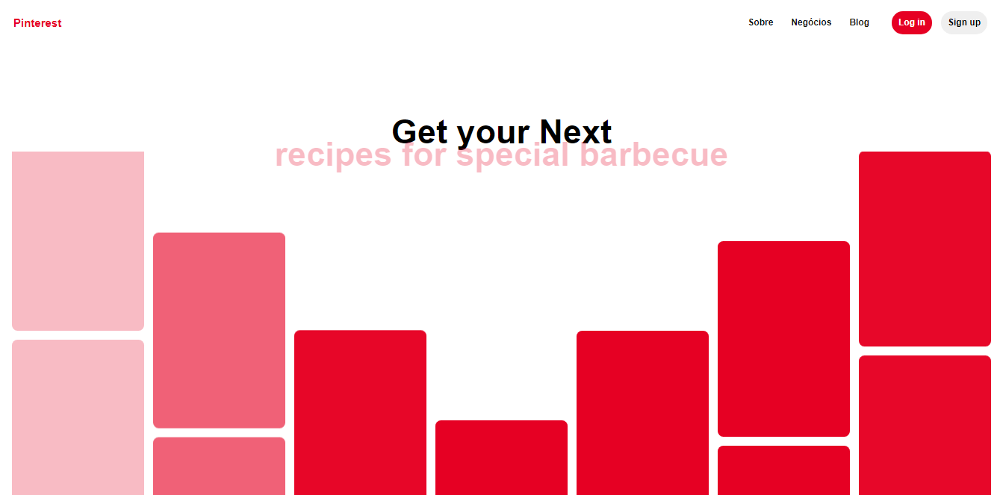

<h1  align="center">Clone UI Pinterest</h1>

 Clone-pinterest é uma aplicação desenvolvida em HTML, Sass e Javascript para recriar a interface da página inicial da rede social Pinterest.

<h2 id="demonstracao">Demonstração</h2>

  
  

<h2 id="autora">👤 Autor</h2>

<h3>Desenvolvido por Ricardo Nagel com auxílio de Rocketseat</h3>

* [Linkedin](https://www.linkedin.com/in/ricardonagel/)

  
<strong align="center">Deixe sua ⭐️ se gostou do projeto</strong>

  
